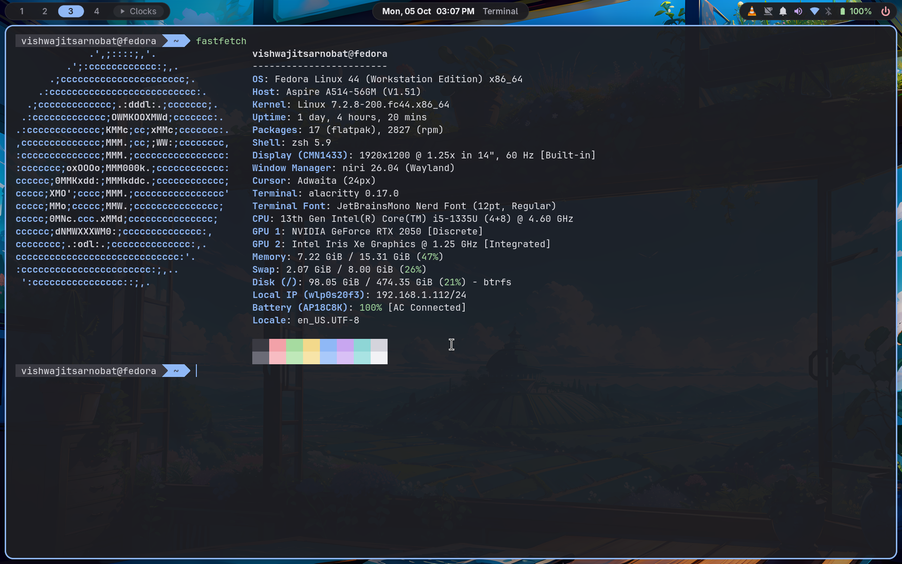
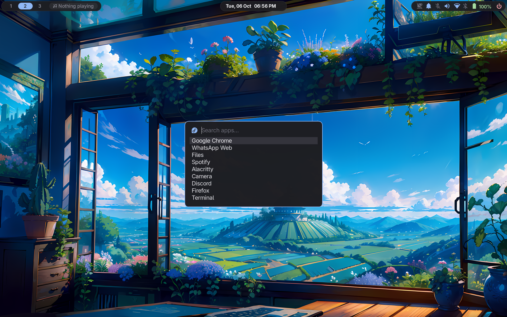
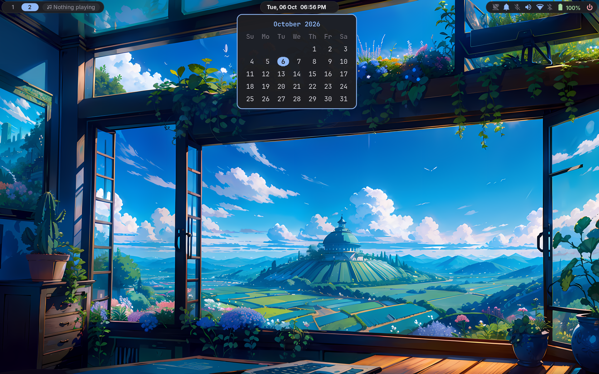
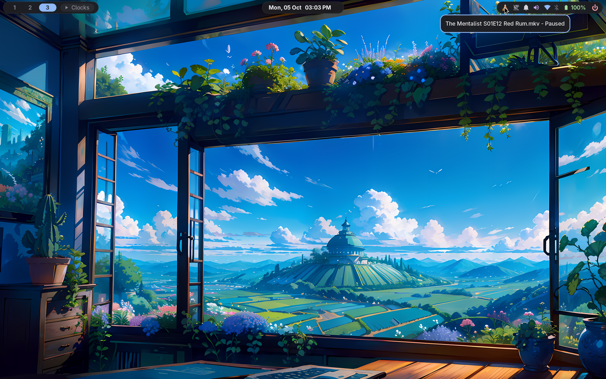
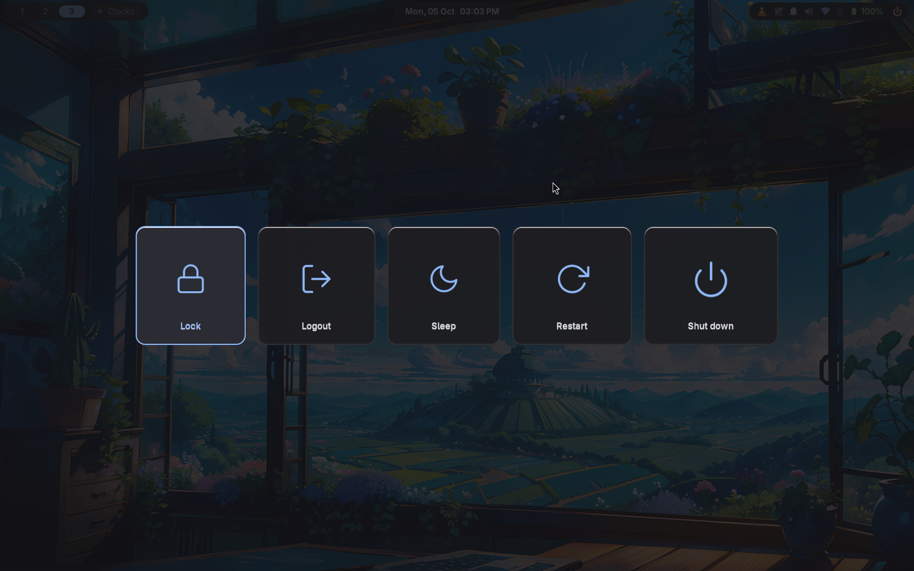

# dotfiles

A calm, keyboard-first [niri](https://github.com/YaLTeR/niri) desktop that
sits alongside GNOME instead of replacing it. Dark GNOME greys,
one blue accent, rounded "island" bars, and GNOME's own Settings for Wi-Fi,
Bluetooth and sound. Style inspired by
[saneAspect](https://www.youtube.com/@saneAspect).

| | |
| --- | --- |
|  |  |
|  |  |
|  |  |

## What you get

- **Window manager:** niri, with scrolling columns of windows, rounded
  corners, a blue border on the focused window, and 8px gaps.
- **Bar:** a top bar in three islands. Workspaces and now playing on the
  left, the clock and a calendar in the centre, status icons on the right.
- **System keys:** one easy-to-remember set, `Mod + Alt + <letter>`, for
  Wi-Fi, Bluetooth, sound, power profiles, do not disturb, lock and more.
- **GNOME underneath:** no extra Wi-Fi, Bluetooth or volume apps. Clicking
  the bar opens the matching GNOME Settings page, and clicking again closes it.
- **Matching look everywhere:** the launcher, terminal, notifications, lock
  screen and power menu all use the same colours.
- **Small touches:** a volume and brightness popup, clipboard history, night
  light, keep-awake, do not disturb, and one key to switch apps between light
  and dark.

## Before you start

- **Any Linux distro with GNOME.** I use and test it on Fedora 44 with niri
  26.04, but nothing in it is Fedora-only. GNOME must stay installed, because
  Settings, Files and the GNOME apps come from it. You can still log in to
  plain GNOME whenever you like.
- **A laptop is assumed.** The bar shows battery, and the brightness keys are
  bound. On a desktop, see [Hardware-specific bits](#hardware-specific-bits).
- **Some parts are specific to my laptop**, an Acer Aspire A514-56GM with
  Intel and NVIDIA graphics. They're harmless elsewhere, but you can drop
  them. See [Hardware-specific bits](#hardware-specific-bits).

## Install

**1. Install the packages.** On Fedora:

```sh
sudo dnf install niri waybar fuzzel alacritty mako swaylock swayidle swaybg \
    wlogout mate-polkit wl-clipboard cliphist wlsunset playerctl \
    brightnessctl ImageMagick libnotify adwaita-sans-fonts stow git
```

On another distro, install the same programs with its package manager.
Names are mostly the same, with a few exceptions:

| Program | What it's for | Notes |
| --- | --- | --- |
| `niri`, `waybar`, `fuzzel`, `alacritty`, `mako` | Window manager, bar, launcher, terminal, notifications | |
| `swaylock`, `swayidle`, `swaybg`, `wlogout` | Lock screen, idle timers, wallpaper, power menu | `wlogout` is in the AUR on Arch |
| `mate-polkit` | Password prompts for admin actions | Any polkit agent works; change its line in the niri config |
| `wl-clipboard`, `cliphist` | Clipboard and clipboard history | |
| `wlsunset` | Night light | |
| `playerctl`, `brightnessctl` | Media keys, brightness keys | |
| `ImageMagick`, `libnotify` | Blurred lock screen, popups | `imagemagick` on Arch and Debian |
| Adwaita Sans font | Interface text | `adwaita-fonts` on Arch |
| `stow`, `git` | Installing these dotfiles | |
| `xwayland-satellite` | Older X11 apps | Usually pulled in with niri |
| `power-profiles-daemon` or `tuned-ppd` | Power profiles | Most GNOME installs already have one |

**2. Install the icon font.** Download
[JetBrainsMono Nerd Font](https://github.com/ryanoasis/nerd-fonts/releases/latest/download/JetBrainsMono.zip),
unzip it into `~/.local/share/fonts/`, then run `fc-cache -f`. Some distros
package it (`ttf-jetbrains-mono-nerd` on Arch). Without it, the bar's icons
show up as empty boxes.

**3. Link the configs.** Each folder in this repo is a
[GNU Stow](https://www.gnu.org/software/stow/) package. Stow links its files
into your home folder, so editing the repo edits your live config.

```sh
git clone https://github.com/vishwajitsarnobat/dotfiles.git ~/dotfiles
cd ~/dotfiles
stow niri waybar fuzzel alacritty mako swaylock wlogout environment scripts
```

If you already have one of these configs (for example `~/.config/niri`),
Stow stops instead of overwriting it. Move yours away, for example
`mv ~/.config/niri ~/.config/niri.bak`, and run `stow` again.

You can install only some packages, but always include `scripts`: niri, the
bar and the power menu all call the commands in it.

**4. Set a wallpaper.** Put your images in `~/Pictures/Wallpapers/` and run
`setwall ~/Pictures/Wallpapers/<image>`. Run `setwall` on its own to list
them. Until you set one, the background is plain dark grey. The wallpaper in
the screenshots is typecraft's
[`nice-blue-background.png`](https://github.com/typecraft-dev/dotfiles/tree/master/backgrounds/.config/backgrounds).

**5. Use GNOME's default apps in niri.** Without this, images and PDFs may
open in the wrong app. If your distro has
`/usr/share/applications/gnome-mimeapps.list` (Fedora does), link it for
niri:

```sh
sudo ln -s /usr/share/applications/gnome-mimeapps.list /usr/share/applications/niri-mimeapps.list
```

If that file doesn't exist, skip this step and set default apps in GNOME
Settings → Apps → Default Apps.

**6. Log in.** Log out, choose **niri** on the login screen, and log in.
Press `Mod + Shift + /` any time to see every key.

## Everyday use

`Mod` is the Super (Windows) key.

### The keys you need first

| Key | Action |
| --- | --- |
| `Mod + T` | Terminal |
| `Mod + D` | App launcher |
| `Mod + E` | Files |
| `Mod + Q` | Close window |
| `Mod + Left / Right` (or `H / L`) | Move between columns |
| `Mod + Up / Down` (or `K / J`) | Move between windows in a column |
| `Mod + 1 … 9` | Go to a workspace |
| `Mod + Ctrl + 1 … 9` | Move the window to a workspace |
| `Mod + R` | Cycle the window width: ⅓, ½, ⅔ |
| `Mod + F` | Make the column full width |
| `Mod + O` | Overview of all windows |
| `Mod + Shift + /` | Show all keys |

The window, workspace and monitor keys are niri's defaults, so niri's own
documentation applies.

### System keys: `Mod + Alt + <letter>`

Most are toggles: press again to undo.

| Key | Action |
| --- | --- |
| `Mod + Alt + W` | Wi-Fi settings |
| `Mod + Alt + B` | Bluetooth settings |
| `Mod + Alt + S` | Sound settings |
| `Mod + Alt + D` | Do not disturb |
| `Mod + Alt + K` | Keep awake (don't lock when idle) |
| `Mod + Alt + E` | Next power profile: power saver, balanced, performance |
| `Mod + Alt + N` | Night light |
| `Mod + Alt + T` | Switch apps between light and dark |
| `Mod + Alt + C` | Clear all notifications |
| `Mod + Alt + V` | Clipboard history |
| `Mod + Alt + L` | Lock screen |
| `Mod + Alt + P` | Power menu |

Volume, mic mute, brightness and media keys work as usual, even on the lock
screen, and show a small level popup.

### Screenshots

| Key | Action |
| --- | --- |
| `Print` | Select an area, then press `Space` to save |
| `Ctrl + Print` | Whole screen |
| `Alt + Print` | Focused window |

Screenshots go to `~/Pictures/Screenshots/` and are also copied to the
clipboard.

### The bar

| Island | What's there |
| --- | --- |
| **Left** | Workspaces · now playing (click: play/pause, right-click: next) |
| **Centre** | Date and time (hover: calendar, scroll: change month, click: back to today) · current window |
| **Right** | Tray · keep awake · do not disturb · microphone · volume · Wi-Fi · Bluetooth · power profile · battery · power |

Hover over any icon to see what its clicks do. The colours follow one rule:
**blue means on, grey means off**. Every crossed-out icon (muted,
disconnected, do not disturb) is grey. Battery is green, turning yellow and
then pink when low.

### Locking and sleep

- **Auto lock:** the screen locks after 15 minutes idle, and the display
  turns off 15 seconds after that.
- **Before sleep:** the screen always locks, even with keep-awake on.
- **Keep awake:** turns off the idle lock until you turn it back off, for
  example while watching a video.

## Make it yours

Changes apply as soon as you save the file, except where the notes say
otherwise.

| To change | Edit | Notes |
| --- | --- | --- |
| Keys | `niri/.config/niri/config.kdl`, `binds { }` | |
| Gaps, borders, corner radius | `niri/.config/niri/config.kdl`, `layout { }` and the first `window-rule` | The negative `struts` make the screen edges 4px while gaps between windows stay 8px |
| Apps that open floating | `niri/.config/niri/config.kdl`, "Small pop-up windows float" | Find an app's ID with `niri msg windows` |
| Monitor layout and scaling | `niri/.config/niri/config.kdl` | Add an `output` block; run `niri msg outputs` to get names |
| Bar icons and their order | `waybar/.config/waybar/config.jsonc`, `modules-right` | Restart the bar: `pkill waybar; waybar &` |
| Bar colours and sizes | `waybar/.config/waybar/style.css` | Colours are defined at the top; restart the bar |
| Clock format, week start | `scripts/.local/bin/waybar-calendar` | 12-hour clock and Sunday-first by default |
| Idle and lock timers | `scripts/.local/bin/idle-watch` | In seconds; log in again to apply |
| Night light warmth | `niri/.config/niri/config.kdl`, the `Mod+Alt+N` line | `-t 4000` is the colour temperature in kelvin |
| Notification timeout | `mako/.config/mako/config`, `default-timeout` | In ms; run `makoctl reload` |
| Terminal font and colours | `alacritty/.config/alacritty/alacritty.toml` | |
| Wallpaper folder | `scripts/.local/bin/setwall`, `WDIR` | |

### Colours

Everything uses one small palette:

| Role | Colour |
| --- | --- |
| Background | `#1e1e22` |
| Raised surface (cards, notifications) | `#2b2b33` |
| Text | `#f2f2f5` |
| Grey (off, inactive) | `#6b6b76` |
| Accent (focus, on) | `#8fb8f6` |
| Pink (urgent, power) | `#f2a1a8` |
| Yellow (warning) | `#f3d98b` |
| Green (battery) | `#a6dba0` |

The accent appears in about a dozen files, including the power menu icons.
To swap it everywhere at once:

```sh
cd ~/dotfiles
grep -rl 8fb8f6 --exclude-dir=.git . | xargs sed -i 's/8fb8f6/YOURHEX/g'
```

Also update the `rgba(143, 184, 246, …)` line in
`waybar/.config/waybar/style.css`: it's the same blue, written as RGB values.

### Hardware-specific bits

| What | Where | Keep it if… |
| --- | --- | --- |
| `XF86Launch6` key bound to mic mute | `niri/.config/niri/config.kdl` | Your mic-mute key does nothing otherwise. Run `wev` and press it to see its name. |
| `GSK_RENDERER=ngl` | `environment/.config/environment.d/gtk.conf` | You have NVIDIA graphics. GTK 4 apps then skip waking the NVIDIA GPU, which saves a few seconds on the first launch. Harmless elsewhere. |
| Battery icon, brightness keys | `waybar/.config/waybar/config.jsonc`, `niri/.config/niri/config.kdl` | You're on a laptop. On a desktop, remove `battery` from `modules-right`. |

## How it fits together

| Folder | App | What it does |
| --- | --- | --- |
| `niri` | [niri](https://github.com/YaLTeR/niri) | Window manager: keys, layout, window rules, startup apps |
| `waybar` | [Waybar](https://github.com/Alexays/Waybar) | Top bar |
| `fuzzel` | [fuzzel](https://codeberg.org/dnkl/fuzzel) | App launcher, also used for clipboard history |
| `alacritty` | [Alacritty](https://alacritty.org) | Terminal |
| `mako` | [mako](https://github.com/emersion/mako) | Notifications, the level popup, do not disturb |
| `swaylock` | [swaylock](https://github.com/swaywm/swaylock) | Lock screen over a blurred copy of the wallpaper |
| `wlogout` | [wlogout](https://github.com/ArtsyMacaw/wlogout) | Power menu |
| `environment` | systemd | Session-wide settings for both niri and GNOME |
| `scripts` | — | The helper commands below, in `~/.local/bin` |

Helper commands, which you can also run yourself in a terminal:

| Command | What it does |
| --- | --- |
| `setwall <image>` | Set the wallpaper (run alone to list saved ones) |
| `theme [light\|dark]` | Switch apps between light and dark, including older GTK 3 apps |
| `lockscreen` | Lock the screen |
| `powermenu` | Open or close the power menu |
| `volume`, `brightness` | Change volume or brightness in 5% steps and show the popup |
| `keep-awake [toggle]` | Show or switch keep-awake |
| `power-profile [name]` | Switch to the next power profile, or to `power-saver`, `balanced` or `performance` |
| `dnd-toggle`, `dnd-status` | Switch or show do not disturb |
| `settings-panel <page>` | Open or close a GNOME Settings page: `wifi`, `bluetooth`, `sound`, `power` |
| `idle-watch [awake]` | The idle timers, started by niri at login |
| `osd`, `lockscreen-bg`, `waybar-calendar`, `waybar-media` | Used internally by the commands above |

## Troubleshooting

- **Icons show as empty boxes:** the Nerd Font isn't installed, or
  `fc-cache -f` wasn't run. See step 2.
- **`stow` reports a conflict:** you already have that config. Move it away
  and run `stow` again.
- **Settings keys or bar clicks do nothing:** GNOME Settings
  (`gnome-control-center`) isn't installed. Install it with your package
  manager; it comes with any full GNOME install.
- **Power profile icon is missing or does nothing:** neither
  `power-profiles-daemon` nor `tuned-ppd` is running. Install one and enable
  its service.
- **No password prompt when an app needs admin rights:** the polkit agent
  didn't start. Check that `mate-polkit` is installed, or point the niri
  config's polkit line at your distro's agent.
- **Changes to `environment` or `idle-watch` don't apply:** both are read at
  login. Log out and back in.

## Removing it

```sh
cd ~/dotfiles
stow -D niri waybar fuzzel alacritty mako swaylock wlogout environment scripts
```

This removes only the links. Your own files, wallpapers and screenshots stay.

## Credits

- [saneAspect](https://www.youtube.com/@saneAspect): style inspiration
- [typecraft](https://github.com/typecraft-dev/dotfiles): wallpaper
- [Feather icons](https://feathericons.com) (MIT): power menu icons
- [Nerd Fonts](https://www.nerdfonts.com): JetBrainsMono Nerd Font
